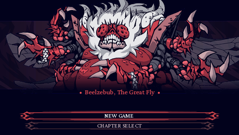
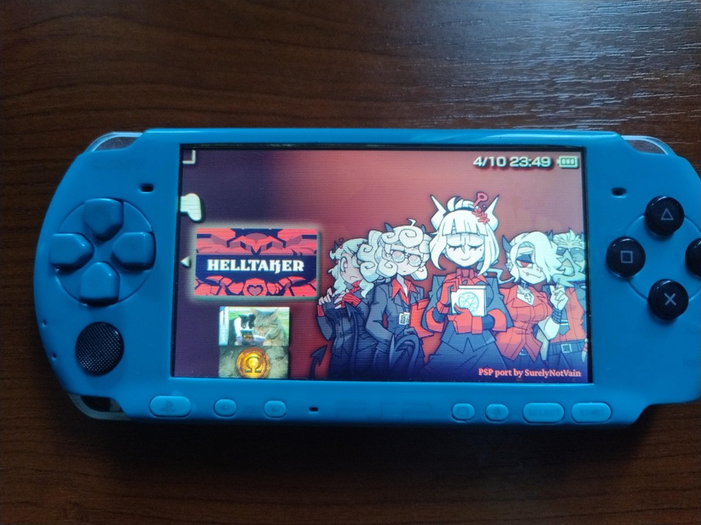
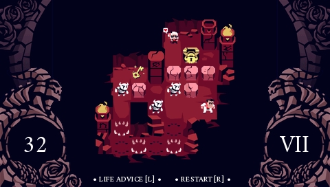
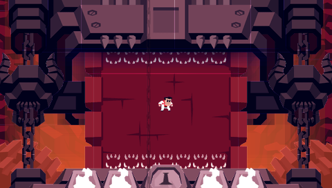
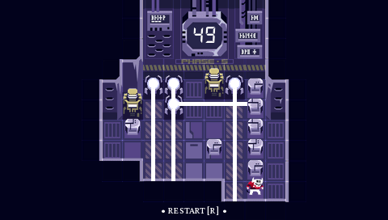
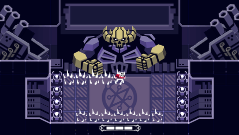
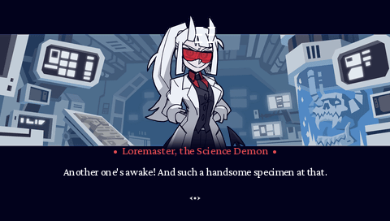

[](https://github.com/surelynotvain/helltaker-psp/releases/latest)
[](https://github.com/surelynotvain/helltaker-psp/releases/latest)

# Helltaker PSP



**Helltaker PSP** is a complete fan-made port (demake) of **Helltaker** and its free **Examtaker** bonus chapter for the Sony PlayStation Portable, by SurelyNotVain. It is PSP homebrew with its own engine written in C, packaged as a standard unsigned application for **ARK-4** and **ARK-5**, and fully playtested on a real PSP-3004.

The whole game is playable: all chapters, the Judgement boss fight, the epilogue and both endings, plus the free **Examtaker** bonus chapter with its lab floors and the final boss.



*Running on a real PSP-3004: Helltaker PSP in the XMB Game menu.*

> [!IMPORTANT]
> This is an unofficial fan project. It is not affiliated with or endorsed by vanripper, Sony, the ARK developers, or the original Helltaker team.

## What's included

### Main game

- Chapters I to IX with every demon, dialogue and both outcomes of each conversation
- Chapter X: the full Judgement boss fight with all four phases, the sin machine, the chains, the HP bar and the glorious success ending
- The epilogue at home, the pancake talks, the secret inscriptions, the ritual dance and the abyss ending
- Chapter select with every chapter you have reached
- The pause menu with the three ritual code panels that fill in as you find the inscriptions
- Credits




### Examtaker

- The intro and the floor picker (start from the beginning or jump to any floor you have reached)
- Lab floors I to VI as Subject 67: lasers that crates and walls block, timed lasers, generators to break and the step counter on the lab monitor
- Floor VII: the Arch Mecha Demon boss with ground spike waves, laser volleys, cannon bombardments and the eraser beam, across all three phases
- The Examtaker door transition, the ending with Lucifer and the Examtaker credits





### Port features

- Native 480x272 presentation using the PSP's hardware renderer (GU)
- Original animations, dialogue portraits, fonts, music and sound effects
- Streamed music
- Animated XMB icon (a chapter I speedrun) and XMB background music
- Progress is saved automatically (reached chapters, ritual pieces and Examtaker floors)
- One step per button press, with a short anti-mash delay so held or bounced buttons never take extra steps
- Works from Memory Stick and from PSP Go internal storage

## Requirements

- A PlayStation Portable that can run unsigned homebrew
- ARK-4, ARK-5 or another compatible custom firmware
- About 100 MB of free storage

Official firmware without a homebrew environment cannot launch this application.

## Download

Download the latest version from the **Releases** section of this repository. The easiest option is `HelltakerPSP.zip`, which already contains the folder to copy.

## Installation

The game folder must contain all three files:

```text
HelltakerPSP/
  EBOOT.PBP
  HT.PAK
  MUSIC.PAK
```

Copy the complete `HelltakerPSP` folder to:

```text
ms0:/PSP/GAME/HelltakerPSP/
```

For PSP Go internal storage, use:

```text
ef0:/PSP/GAME/HelltakerPSP/
```

Then open the Game menu on the PSP and launch **Helltaker PSP**.

> [!WARNING]
> Do not copy `EBOOT.PBP` on its own. `HT.PAK` holds the graphics and sound effects and `MUSIC.PAK` holds the music. Both must stay in the same folder as the EBOOT.

## Updating

1. Exit the game.
2. Replace `EBOOT.PBP`, `HT.PAK` and `MUSIC.PAK` in `PSP/GAME/HelltakerPSP/` with the files from the new release.
3. Keep `SETTINGS.BIN` if it is there. It is your save file (progress and settings).

Older releases only had `EBOOT.PBP` and `MUSIC.PAK`. This version also needs `HT.PAK`, so copy all three.

## Controls

| Button | Action |
|---|---|
| D-pad or analog stick | Move one tile per press, navigate menus |
| Cross (X) | Confirm, advance dialogue |
| Circle (O) | Back |
| START | Pause menu |
| R or Square | Restart the level |
| L or Triangle | Life advice (hint) |
| HOME | PSP exit menu |

Movement is turn based. Each press moves one tile, so release the direction before the next step.

## Compatibility

| Environment | Status |
|---|---|
| ARK-4 | Supported |
| ARK-5 | Supported |
| PSP-1000 | Supported (standard 24 MB memory layout, no expanded memory needed) |
| PSP-2000 / 3000 / Street | Supported (fully playtested on a PSP-3004) |
| PSP Go Memory Stick | Supported |
| PSP Go internal storage | Supported through `ef0:` |

The whole game, including Examtaker, has been fully playtested on a real PSP-3004. Minor bugs found during that playtest are being fixed in ongoing updates. Reports from other models are very welcome, especially from PSP-1000 owners on the Examtaker boss floor, which is the most demanding scene.

## Troubleshooting

### The game does not appear in the Game menu

The folder structure must be exactly:

```text
PSP/GAME/HelltakerPSP/EBOOT.PBP
```

Avoid an extra nested folder such as `PSP/GAME/HelltakerPSP/HelltakerPSP/EBOOT.PBP`.

### Black screen, missing graphics or no sound effects

Make sure `HT.PAK` is in the same folder as `EBOOT.PBP` and that it was copied completely (about 28 MB). Recopy it if in doubt.

### No music

Make sure `MUSIC.PAK` is in the same folder as `EBOOT.PBP` and that it was copied completely (about 71 MB). Keep the file names in upper case.

### Music stutters

Slow or damaged storage can interrupt streamed audio. Try copying the game again, using another Memory Stick or disabling plugins.

### The game returns to the XMB

1. Check that all three files were copied completely.
2. Update ARK to a recent version.
3. Launch the game directly from the XMB.
4. Temporarily disable game related plugins.
5. Try another Memory Stick if you have one.

## Reporting bugs

Bug reports and hardware reports are welcome through GitHub Issues. Please include:

- PSP model
- ARK version
- Installation path (`ms0:` or `ef0:`)
- Active plugins
- The chapter or floor and what you were doing
- Steps to reproduce the problem
- A photo or video if the problem is visual

## Notes

The source code of the PSP engine is available in the [`engine`](engine/) folder. Game assets, converted game data and the data conversion tools are not included.

Please do not redistribute modified releases under the same name without clearly marking them as unofficial modifications.

## Credits

- **Helltaker** and **Examtaker** were created by **vanripper** (Łukasz Piskorz).
- Sound design by Patryk Karwat. Music by Mittsies.
- PSP homebrew development is supported by the PSPSDK and pspdev communities.
- ARK compatibility is thanks to the ARK community and its contributors.
- PSP port by SurelyNotVain.

All original Helltaker names, characters, artwork, music and related assets belong to their respective creators and rights holders. Helltaker is free on Steam; please support the original creator.

## Disclaimer

This project is provided for educational, preservation and entertainment purposes. It is not an official release and comes without any warranty. The developers of this port are not responsible for data loss, storage corruption, console damage or problems caused by firmware modifications or third party plugins.
